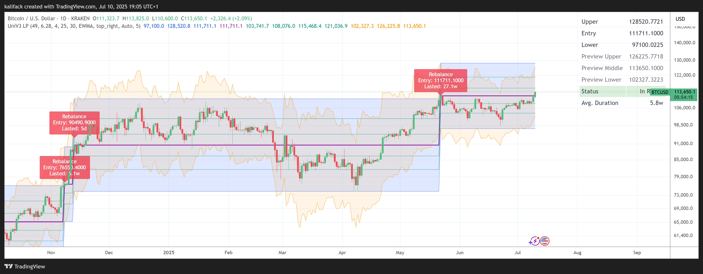
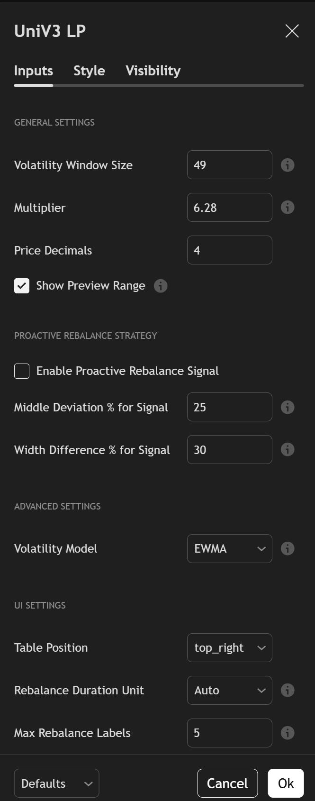

# Uniswap V3 Liquidity Range & Fibonacci Indicator

## Configuration

Easily customize the indicator's behavior and appearance through its intuitive settings. Below is a screenshot of the input parameters:

## Overview

This is an advanced PineScript v6 indicator for TradingView designed to help Uniswap V3 liquidity providers (LPs) make more informed decisions. It dynamically calculates and visualizes optimal liquidity ranges based on market volatility, incorporates Fibonacci levels for potential support and resistance, and provides proactive signals for when to consider rebalancing a position.

The goal is to move beyond static, manually-set ranges and provide a data-driven approach to liquidity provision, helping LPs maximize fee capture while managing the risk of price movements.

## Key Features

*   **Dynamic Volatility Ranges:** Automatically calculates upper and lower liquidity bounds based on a selected volatility model (EWMA or Standard Deviation) and window size.
*   **Proactive Rebalance Signals:** Notifies you when the current price has deviated significantly from your range's center or when market volatility has changed, suggesting it may be time to create a new position.
*   **Integrated Fibonacci Levels:** Plots key Fibonacci retracement levels within your active range to identify potential intra-range price targets or turning points.
*   **"Preview" Mode:** See a hypothetical new range based on the current price *before* you decide to rebalance.
*   **Comprehensive Dashboard:** A clean, on-chart table displays all critical information:
    *   Active Upper & Lower Bounds
    *   Preview Upper & Lower Bounds
    *   Position Entry Price
    *   Current Status (In Range, Out of Range, Proactive Signal)
    *   Average Range Duration
*   **Customizable:** Easily adjust the volatility window, range width multiplier, and all visual elements to fit your trading style.
*   **Code Lore:** Includes a unique `CODE_LORE.md` file that explains the script's variable names through a creative narrative, making the code both functional and memorable.

## How to Use

1.  **Open TradingView:** Navigate to a chart of your choice.
2.  **Open Pine Editor:** Click on the "Pine Editor" tab at the bottom of the chart.
3.  **Copy Code:** Copy the entire content of the `UniLpF.pine` file.
4.  **Paste in Editor:** Paste the code into the Pine Editor, replacing any default text.
5.  **Add to Chart:** Click the "Add to chart" button.

The indicator will now be active on your chart. You can customize its settings by clicking the "Settings" (gear) icon next to the indicator's name.

## License

This project is licensed under the MIT License. See the [LICENSE](LICENSE) file for details.
