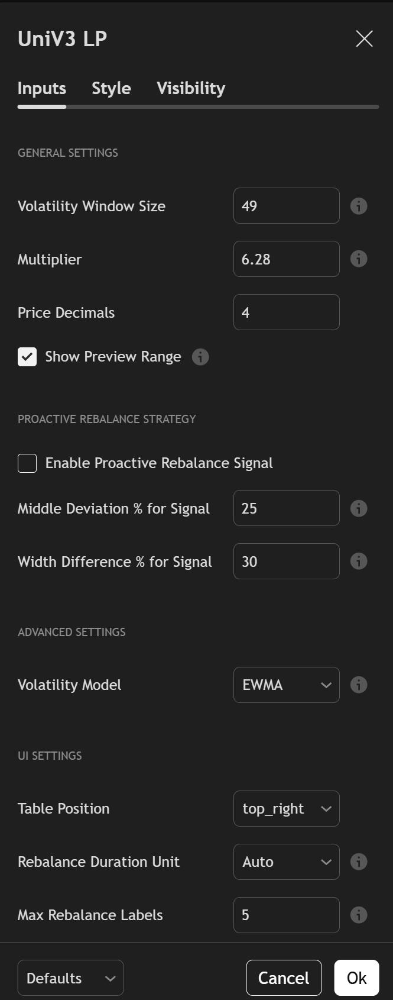

# Uniswap V3 Liquidity Range & Fibonacci Indicator

## Configuration

Easily customize the indicator's behavior and appearance through its intuitive settings. Below is a screenshot of the input parameters (Note: This screenshot is a placeholder and does not reflect all current input options):

## Overview

This is an advanced PineScript v6 indicator for TradingView designed to help Uniswap V3 liquidity providers (LPs) make more informed decisions. It dynamically calculates and visualizes optimal liquidity ranges based on market volatility, incorporates **manual Fibonacci levels**, provides **dynamic volume visualization**, and offers **smart rebalancing anchored to user-defined Support/Resistance (S/R) levels**.

The goal is to move beyond static, manually-set ranges and provide a data-driven approach to liquidity provision, helping LPs maximize fee capture while managing the risk of price movements.

## Key Features

*   **Dynamic Volatility Ranges:** Automatically calculates upper and lower liquidity bounds based on a selected volatility model (EWMA or Standard Deviation) and window size.
*   **Proactive Rebalance Signals:** Notifies you when the current price has deviated significantly from your range's center or when market volatility has changed, suggesting it may be time to create a new position.
*   **Integrated Manual Fibonacci Levels:** Allows users to manually define two points on the chart to draw and extend standard Fibonacci retracement/extension levels, providing precise control over analysis.
*   **Dynamic Volume Visualization:** The active liquidity range's background color dynamically intensifies based on the comparison of current period volume to a previous period's volume, offering an intuitive visual cue of market activity and potential profitability within the range.
*   **Manual Support/Resistance (S/R) Anchoring:** Define up to 5 custom S/R levels. When a rebalance is triggered, the new liquidity range can intelligently anchor its midpoint to the nearest relevant S/R level, within a user-defined proximity, anticipating potential bounces or rejections.
*   **"Preview" Mode:** See a hypothetical new range based on the current price *before* you decide to rebalance.
*   **Comprehensive Dashboard:** A clean, on-chart table displays all critical information:
    *   Active Upper & Lower Bounds
    *   Preview Upper & Lower Bounds
    *   Position Entry Price
    *   Current Status (In Range, Out of Range, Proactive Signal)
    *   Average Range Duration
    *   Cumulative Volume within the current range
    *   Volume Comparison (current period vs. previous period)
    *   Manual S/R status (Enabled, In S/R Zone)
*   **Toggleable On-Chart Volume Bars:** Option to display a traditional volume histogram directly on the main chart for quick reference.
*   **Customizable:** Easily adjust the volatility window, range width multiplier, volume comparison period, S/R proximity, and all visual elements to fit your trading style.
*   **Code Lore:** Includes a unique `CODE_LORE.md` file that explains the script's variable names through a creative narrative, making the code both functional and memorable.

## How to Use

1.  **Open TradingView:** Navigate to a chart of your choice.
2.  **Open Pine Editor:** Click on the "Pine Editor" tab at the bottom of the chart.
3.  **Copy Code:** Copy the entire content of the `UniLpF.pine` file.
4.  **Paste in Editor:** Paste the code into the Pine Editor, replacing any default text.
5.  **Add to Chart:** Click the "Add to chart" button.

The indicator will now be active on your chart. You can customize its settings by clicking the "Settings" (gear) icon next to the indicator's name.

## License

This project is licensed under the MIT License. See the [LICENSE](LICENSE) file for details.